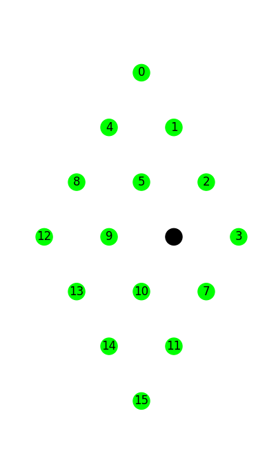

# AIProg

IT3105 - Project 1 - Peg solitaire

This is the first of 3 projects in IT3105 - Artificial Intelligence Programming.

The goal of the project is to solve Peg solitaire, both triangle and diamond with varying sizes and missing pins.

To achieve this two types of actor-critic models are implemented, one with a table critic and one with a neural network critic.

Project 2 and 3 was done with a group [in this repo](https://github.com/NikZy/IT3105-AiProg)

---
## Learning rate

---

## 5x5 triangle board and solution

-----
## 4x4 diamond board and solution

